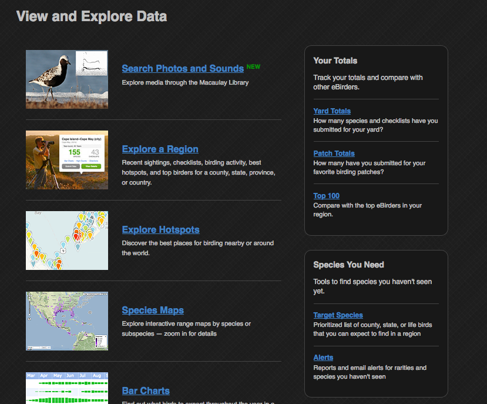

# eBird-Dark

A dark theme designed for http://ebird.org/

# Status

This theme is still early in development.  Please report any problems by opening a new [issue](https://github.com/overdodactyl/eBird-Dark/issues) or messaging me on Reddit (u/overdodactyl).

# Sample Screenshots

# Using eBird-Dark

The eBird-Dark theme is hosted on userstyles.org [here](https://userstyles.org/styles/154594/ebird-dark).

In order to install the theme, you will need a browser addon, such as Stylus:

* [Firefox](https://addons.mozilla.org/en-US/firefox/addon/styl-us/)
* [Chrome](https://chrome.google.com/webstore/detail/stylus/clngdbkpkpeebahjckkjfobafhncgmne)
* [Opera](https://addons.opera.com/en-gb/extensions/details/stylus/)
